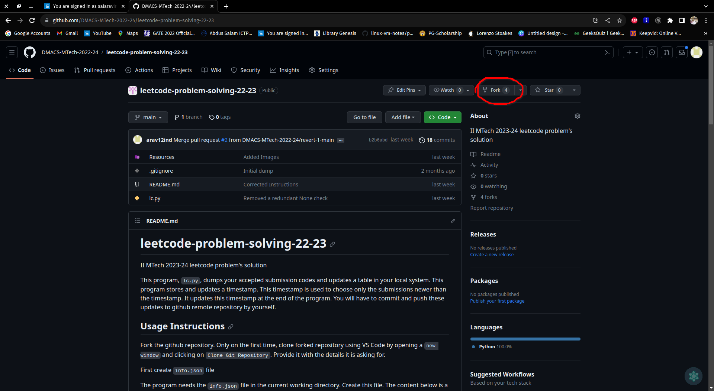
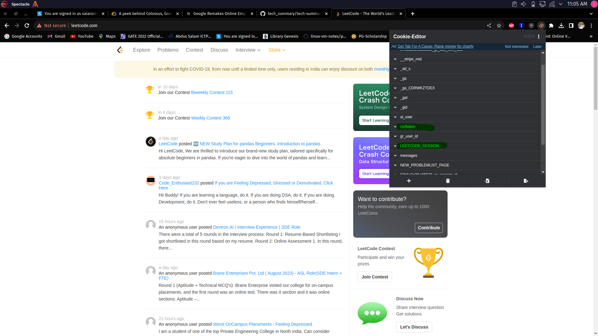
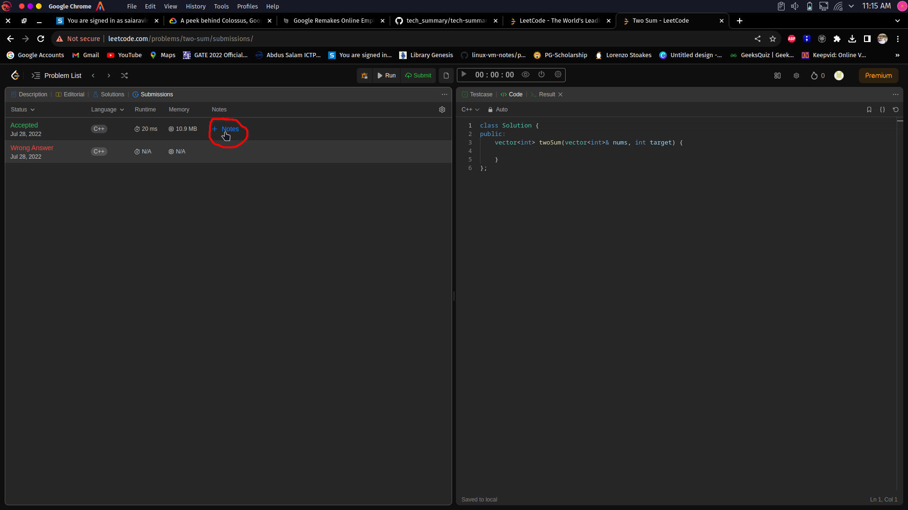
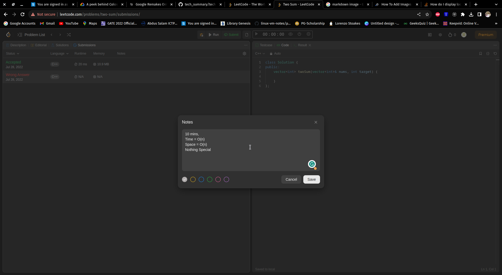

# leetcode-problem-solving-22-23
II MTech 2023-24 leetcode problem's solution

This program, `lc.py`, dumps your accepted submission codes and updates a table in your local system. This program stores and updates a timestamp. This timestamp is used to choose only the submissions newer than the timestamp. It updates this timestamp at the end of the program. You will have to commit and push these updates to GitHub remote repository by yourself.

## Usage Instructions
Fork the GitHub repository.



Only the first time, clone the forked repository using VS Code by opening a `new window` and clicking on `Clone Git Repository`. Provide it with the details it is asking for.

First create `info.json` file

The program needs the `info.json` file in the current working directory.
Create this file. The content below is a template and is not to be used as is.
```json
{
    "num_retries": 10,
    "retry_wait": 5,
    "code_path": "codes",
    "problems_url": "https://leetcode.com/problems/",
    "graphql_url": "https://leetcode.com/graphql/",
    "file_unicode_symbol": "&#128193;",
    "data_file": "data.pkl",
    "timestamp_file": "README.adoc",
    "limit": 10,
    "note_replaces": {
        "\n": " +\n",
        "|": "\\|"
    },
    "colour_map": {
        "Easy": "green-background",
        "Medium": "yellow-background",
        "Hard": "red-background"
    },
    "submissions_path": "README.adoc",
    "reg": "Your Registration Number",
    "name": "Your Name",
    "LEETCODE_SESSION": "LEETCODE_SESSION from browser cookies",
    "csrftoken": "csrftoken from browser cookies"
}
```
Change the values for the following entries. \
`reg`, `name`, `LEETCODE_SESSION`, `csrftoken`. \
The value of `reg` is your registration number and the value of `name` is your name
The `LEETCODE_SESSION` and `csrftoken` can be found by using a cookie editor extension on a browser. \
Use it when opening the leetcode.com after login. \
This cookie editor will give the `LEETCODE_SESSION` and `csrftoken` values. \
These values must be put in the `info.json` file and must be enclosed with double quotes.



Here is an example `info.json` file. This too should not be used as is, it is an example.
```json
{
    "num_retries": 10,
    "retry_wait": 5,
    "code_path": "codes/",
    "problems_url": "https://leetcode.com/problems/",
    "graphql_url": "https://leetcode.com/graphql/",
    "file_unicode_symbol": "&#128193;",
    "data_file": "data.pkl",
    "timestamp_file": "README.adoc",
    "limit": 10,
    "note_replaces": {
        "\n": " +\n",
        "|": "\\|"
    },
    "colour_map": {
        "Easy": "green-background",
        "Medium": "yellow-background",
        "Hard": "red-background"
    },
    "submissions_path": "README.adoc",
    "reg": "123456",
    "name": "Sai Ram",
    "LEETCODE_SESSION": "eyJ0eYAiOiJKV1QiLCJhbGciOiJIUzI1NiJ9.eyJfYXV0aF91c2VyX2lkIjoiNDT3NzZzNCIsIl9hdXRoX3VzZXJfYmFja2VuZCI6ImFsbGF1dGguYWNjb3VudC5hdXRoX2JhY1tlbmRzLkF1dGhlbnRpY2F0aW9uQmFja2VuZCIsIl9hdXRoX3VzZXJfaGFzaCI6Ijg0YTgyMrg1Mzk3ZWE1NjAwZGVjNWJlNzBmYjZhMGZhOWJhY2E4NTUiLCJpZCI6NDY3NzMzNCwiZW1haWwiOiJzYWlhcmF2aW5kLnN2QGdtYWlsLmNvbSIsInVzZXJuYW1lIjoiYXJhdjEyaW5kIiwidXNpcl9zbHVnIjoiYXJhdjEyaW5kIiwiYXZhdGFyIjoiaHR0cHM6Ly9hc3NldHMubGVldGNvZGUuY29tL3VzZXJzL2FyYXYxMmluZC9hdmF0YXJfMTYyNzkxMDk0Mi5wbmciLCJyZWZyZXNoqohfYXQiOjE2OTYzOTc2OTgsImlwIjoiMTQuMTM5Ljg2LjU0IiwiaWRlbnRpdHkiOiI2ZDc5N2EzZDIxZWIzMGMzYWYwNThhYjNhMmJmNTYyZCIsInNlc3Npb25faWQiOjQ1MDQzODcyfQ.oF6DWNUmPpZhQNJ939fF9og0FOlwyFbJT-zCukWksFo",
    "csrftoken": "yYUukQCy1O2CnjwOVKkfyjBOobsTs619AqXu9XdRgE4TpLhvGhwg3nIi8IouXO74"
}
```

Now run
```bash
python lc.py -g
```
The script has three options, `-g`, `-n` and `-r`.
- The option `-g` gets new submission from leetcode and updates the `data.pkl` file. It then rebuilds the README file.
- The option `-n` updates the notes it has stored in the `data.pkl` file and then rebuilds the README file.
- The options `r` rebuilds the README file.
- Exactly one of these options must be provided at the launch of the program.

If the program exits due to some value being none, even after retying many times, then the problem is either due to internet or due to expiration of `LEETCODE_SESSION` and `csrftoken`. If it is confirmed that the problem is not due to internet then, refresh the `LEETCODE_SESSION` and `csrftoken` values by again getting those values from the brwoser's cookie editor extension.

Each time you will push your submissions only to your forked repository. You can do a pull request to apply these changes to the original repository.

Whenever a submission is made, remember to write notes for it in the leetcode itself.



